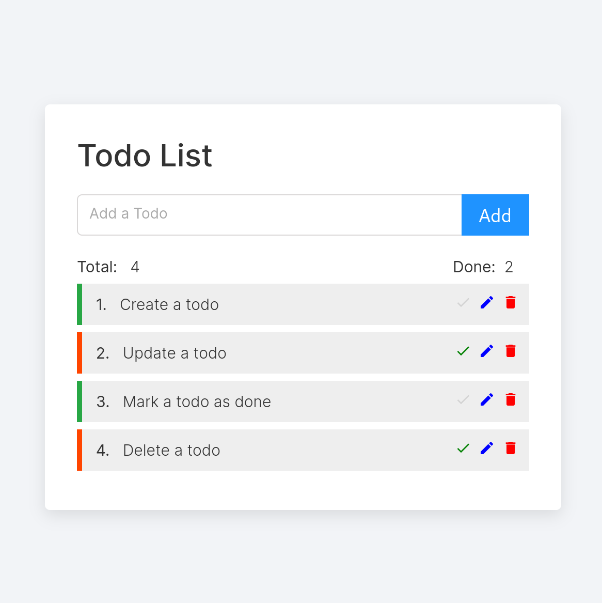
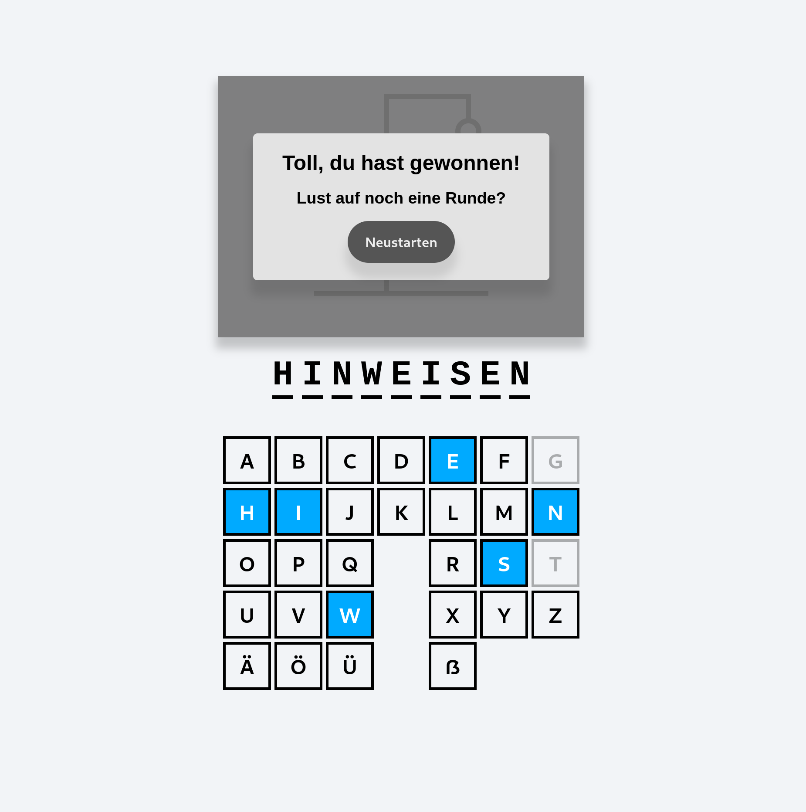
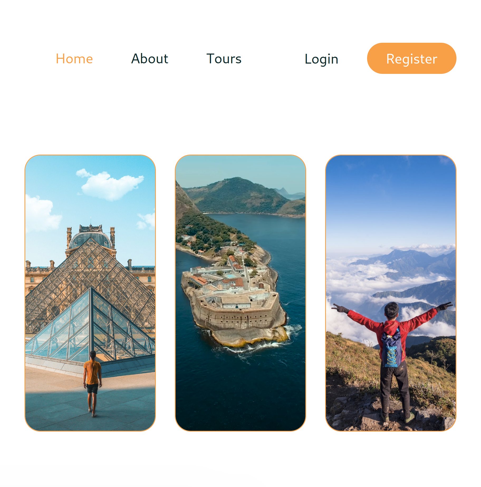
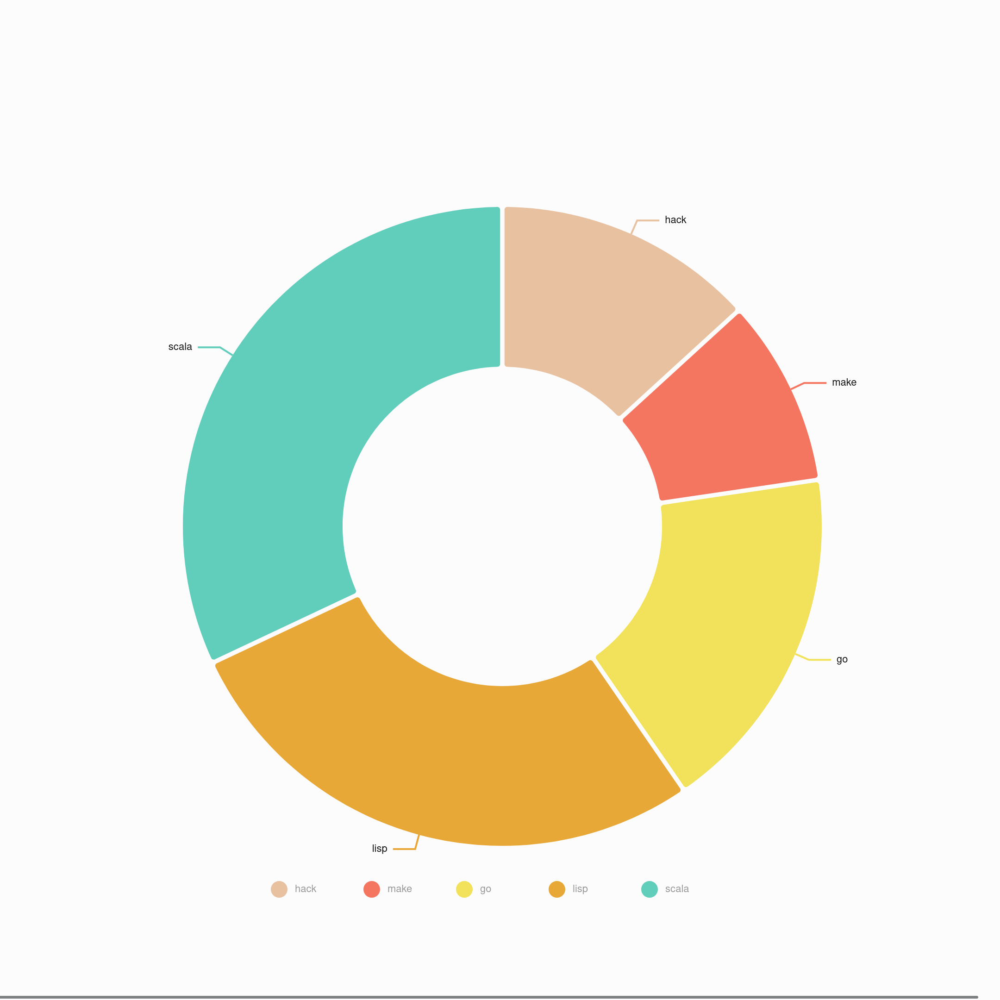

# My Projects

## 1. Todo List

- A simple MERN stack web application: MongoDB + Express + ReactJS + NodeJS.

- CRUD implementation: Create, read, update & delete.

- Technologies used: react-icons/md, react-tooltip, react-toastify

### How to Use

It's designed to be simple and straightforward to use. And Tool Tips are in place to help. 

- Type in your todo task in the input field of the form, and then press the "Add" button to add the task to your todo list. Press the ENTER key works too. The input field can't be empty though, or you'll be greeted with a kind reminder to fill out the field. 

- Click on the green tick symbol to mark an todo as done, provided it's not done already. When an todo is marked as done, the green tick will turn gray. 

- To edit an existing todo, click on the blue pencil symbol. By doing this, the original content of the todo will be sent to the input field, where you make your changes. The "Add" button in this case will be changed to "Edit" correspondingly. Click on the "Edit" button to submit your changed todo and send it to the list. Done todos can be edited as well, and it'll be marked as undone after you have edited it. 

- To delete a todo, click on the red trash can symbol. 

- Each operation comes with react-toastify notifications. And two numbers are updated automatically: the total number of todos, and the number of done todos. 

## 2. Hangman

- The world renowned Hangman word game, but in German, i.e. Galgenmännchen.

- Build with TypeScript.

- Handled tricky problems imposed by the German language - German umlauts (ä,ö,ü) and the sharp S (ß) , to be exact. 

### How to Play

- At the start of the game, a random German word will be chosen as the word to be guessed. Its length varies from 5 to 15, and it is your job to find out this word in order to save the poor man from hanging in there. 

- You can simply click on any of the possible letters on the visual keyboard: 26 common letters, plus four more to give you the German flavor - ä,ö,ü and ß. 

- Typing with your physical keyboard works too - you'll just have to figure out how to type ä,ö,ü and ß yourself, which depends on your keyboard configuration. 

- If your input has its place(s) in the word to guess, it will be shown, and accordingly, the letter will be marked as a blue square, meaning that you have guessed it right and could therefore leave it out in the following guesses. 

- If your input is not in the word to guess, the poor hangman will start to materialize in the gallows, and accordingly, the letter will be marked as gray. Note that the hangman consists of six parts - the head, the body, the two arms, and the two legs. Therefore, you are allowed to make six wrong guesses.

- When you successfully figure out all the letters in the word to guess, congratulations, you have won and saved the hangman. If you anyhow exhausted your six chances, sorry, you lose. Either way, you will be greeted with a popup box, and the word to guess will be shown in full. Now you can start anew, by clicking on the "Neustarten" (German for "restart") button.

- You can always restart the game by pressing ENTER or ESC, be it you have reached the end or not. 

### What's next

- An additional feature could be to display the definition of that word, if there won't be any copyright issues. 

- With user accounts in place, we can an arena out this game, with records of your success rates with each German word. A Hall of Fame is sure to happen. 

## 3. Travel Agency Website

- **MERN project** with the ability to retrieve and update data from MongoDB database. 

- Fully functional website with Register/Login functionalities. 

- Tours searchable by location, distance, and/or max numbers of tourists.

- Book tours with auto-calculated total fees based on the tour, the number of persons and service fees. 

- Replaced Google Fonts with Coollabs alternatives for privacy concerns. 

## Technologies Used

- Frontend: react-router-dom; react-responsive-masonry; react-slick; reactstrap; remixicon; slick-carousel

- Backend: bcryptjs; cookie-parser; jsonwebtoken; cors

## How to Use

- At the Homepage, you can see what is expected of a normal travel booking website, with an brief introduction to TravelWorld, and a list of tours TravelWorld has to offer. You can click on a specific tour to view the details, and whatever comments that are already there. You will need an account to book your own tour and share your experience of your tours in the comments section. If you try to book a tour before you have signed in, you will be reminded to do so.

- Start by registering an account with TravelWorld with an email address and a password. At this stage, we are not requiring verification via email, so feel free to use a fake email account, simply for the purpose of exploring what TravelWorld has to offer. Your password will be salted and hashed by bcrypt.js.

- With your own account created, you can now log into the system. The authorization and information exchange processes are taken care by Jason Web Tokens. Your login will expire in seven days, which can be customized of course, or when you have cleared the cookies of the website, or when you have logged out yourself. 

- Now you can book your tours. But don't worry, we are not going to actually charge you for now. Just have a go and try to fill out the required information - your name, your phone number, your preferred date of travel, and the number of persons. You don't have to give out personal information, just make up something, but remember to respect the format, i.e. let names be names (or letters), dates be dates, and numbers be numbers. If the formats don't match, or some fields are left blank, the system will complain. If everything goes as required, then congratulations, your tour is booked. 

- And you can now make a comment. Give it a Star Rating from 1 to 5, and share with others whatever you feeling like sharing about your tour.

## What's Next

A lot more can be added to make the website more business ready. 

- Promotions and Coupons are typical marketing strategies. Old school maybe, but also very effective.

- Payments methods.

- Verification via email.

- Option to change login details (email, password, username, etc.)

- Tourists details that may be required to book hotels, flights, tickets, etc.

- A user should be able to make a comment on a tour if they have actually booked that tour and done it. 

## 4. Admin Dashboard

- **MERN project** built with Material UI design

- Dark/Light mode support

- Graphic rich for showcasing dashboard data, and could easily be expanded and customized. 

- Replaced Google Fonts with Coollabs alternatives for privacy concerns. 

## Technologies Used

- Frontend: MUI; Emotion; Nivo; react-router-dom; react-datepicker; react-redux; redux.js
- Backend: body-parser; helmet; morgan; country-iso-2-to-3; cors

## How to Use

This dashboard is meant to showcasing how information can be gathered and processed to an user or administrator or super-administrator of a certain platform, for example, an E-commerce platform. 

- list all the products available on the platform.

- list of customers with their user details. 

- list of transactions, with columns and density customizable. 

- See where your users/clients are located throughout the world. 

- Sales Overview, daily and monthly sales performance, breakdown of sales by categories. 

- Manage your users and track affiliate sales performance. 

- Reports ready to be downloaded to your local machine. 

## What's Next

- Setting

- Registration / Login

- Authorization matrix. 

- Tickets / feedback to a specific user, if it's authorized to do so. 
